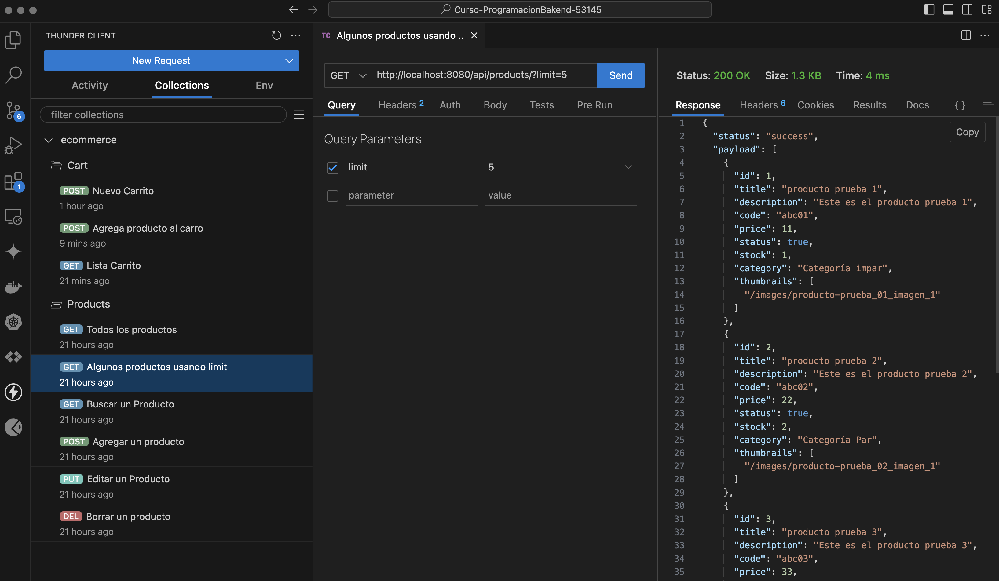

# Rubén Roldán - Primera entrega hacia el proyecto final
Curso CoderHouse Programación Backend, Comisión 53145

## Descripción de la entrega

### Consigna
Desarrollar un servidor que contenga los endpoints y servicios necesarios para gestionar los productos y carritos de compra en el e-commerce

### Aspectos a incluir
Desarrollar el servidor basado en Node.JS y express, que escuche en el puerto 8080 y disponga de dos grupos de rutas: /products y /carts. Dichos endpoints estarán implementados con el router de express, con las siguientes especificaciones:

- Para el manejo de productos, el cual tendrá su router en /api/products/ , configurar las siguientes rutas:
    - La ruta raíz GET / deberá listar todos los productos de la base. (Incluyendo la limitación ?limit del desafío anterior)
    - La ruta GET /:pid deberá traer sólo el producto con el id proporcionado
    - La ruta raíz POST / deberá agregar un nuevo producto con los campos:
        - id: Number/String (A tu elección, el id NO se manda desde body, se autogenera como lo hemos visto desde los primeros entregables, asegurando que NUNCA se repetirán los ids en el archivo.)
        - title:String,
        - description:String
        - code:String
        - price:Number
        - status:Boolean
        - stock:Number
        - category:String
        - thumbnails:Array de Strings que contenga las rutas donde están almacenadas las imágenes referentes a dicho producto
            - Status es true por defecto. 
            - Todos los campos son obligatorios, a excepción de thumbnails.
    - La ruta PUT /:pid deberá tomar un producto y actualizarlo por los campos enviados desde body. NUNCA se debe actualizar o eliminar el id al momento de hacer dicha actualización.
    - La ruta DELETE /:pid deberá eliminar el producto con el pid indicado.

- Para el carrito, el cual tendrá su router en /api/carts/, configurar dos rutas (en realidad son 3):
    - La ruta raíz POST / deberá crear un nuevo carrito con la siguiente estructura:
        - Id:Number/String (A tu elección, de igual manera como con los productos, debes asegurar que nunca se dupliquen los ids y que este se autogenere).
        - products: Array que contendrá objetos que representen cada producto.
    - La ruta GET /:cid deberá listar los productos que pertenezcan al carrito con el parámetro cid proporcionados.
    - La ruta POST /:cid/product/:pid deberá agregar el producto al arreglo “products” del carrito seleccionado, agregándose como un objeto bajo el siguiente formato:
        - product: SÓLO DEBE CONTENER EL ID DEL PRODUCTO (Es crucial que no agregues el producto completo)
        - quantity: debe contener el número de ejemplares de dicho producto. El producto, de momento, se agregará de uno en uno.
        Además, si un producto ya existente intenta agregarse al producto, incrementar el campo quantity de dicho producto.

- La persistencia de la información se implementará utilizando el file system, donde los archivos “productos,json” y “carrito.json”, respaldan la información. No es necesario realizar ninguna implementación visual, todo el flujo se puede realizar por Postman o por el cliente de tu preferencia.

## Instalación y ejecución
- Para descargar el código se recomienda clonar el repositorio desde una linea de comandos ejecutando: `git clone https://github.com/rroldanb/Curso-ProgramacionBakend-53145.git `
- Ingresar a la carpeta generada al clonar el repositorio mediante `cd Curso-ProgramacionBakend-53145`
- Instalar la dependencias mediante `npm i`
- Verificar que el puerto 8080 no esté en uso con el comando `lsof -i :8080`
- Ejecutar el código mediante el uso de alguno de los scripts:
    - `npm start` Este script inicia la aplicación ejecutando el archivo src/app.js con Node.js. Es útil para iniciar la aplicación en un entorno de producción.
    - `npm run dev` Este script utiliza Nodemon para iniciar la aplicación con la capacidad de reiniciarse automáticamente cada vez que detecta cambios en los archivos.
    - `npm run start:dev` Este script inicia la aplicación en un entorno de desarrollo, similar al script "dev", pero utilizando directamente Node.js con la opción --watch para observar cambios en el archivo src/app.js. Aunque proporciona funcionalidad similar a la anterior, algunos desarrolladores pueden preferir esta opción si no quieren depender de Nodemon.
- Para detener la ejecución de la aplicacion presinonar juntas las teclas: Ctrl + C

## Métodos HTTP disponibles
- En el cliente de HTTP se recibirá una respuesta en los siguientes enpoints:

    - Método GET de productos:
        - http://localhost:8080/api/products sin query, eso devolverà los 10 productos con que se inicializó el proyecto.
        - http://localhost:8080/api/products?limit=n , eso devolverà los primeros 5 productos. El número del límite n puede ser un entero entre el 1 y el 10
        - http://localhost:8080/api/products/:pid, eso devolverà sólo el producto con id=:pid (product id). El :pid puede ser un entero entre el 1 y el 10
        - http://localhost:8080/api/products/34123123, al no existir el id del producto, devolverà un objeto con un error indicando que el producto no existe.

    - Método POST de productos:
        - http://localhost:8080/api/products incluyendo al menos todos los campos obligatorio en el body del request creará un nuevo producto, se valida que el código del producto no exista.

    - Método PUT de productos:
        - http://localhost:8080/api/products/:pid permite modificar el producto con el :pid indicado con los nuevos valores indicados en el body del request.

    - Método DELETE de productos:
        - http://localhost:8080/api/products/:pid eliminara el producto con el :pid indicado
    
    - Método GET del carrito:
        - http://localhost:8080/api/cart:cid devolverá los productos que pertenezcan al carrito con el parámetro cid proporcionados.

    - Método POST del carrito:
        - http://localhost:8080/api/cart iniicializará un nuevo carrito y devolverá el cid (cart id)
        - http://localhost:8080/api/cart/:cid/product/:pid agregará o incrementará la cantidad de productos con el :pid indicado en el :cid indicado

- Para ejecutar las pruebas de los endpoints se incluye el archivo `thunder-collection_ecommerce.json` dentro de la carpeta `/src/utils` que puede ser importado al cliente HTTP "Thunder Client", que funciona como una extencion de VSCode

 RR 04/24 

