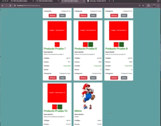

# Rubén Roldán - Desafío entregable #4 Websockets
Curso CoderHouse Programación Backend, Comisión 53145

## Descripción de la entrega

### Consigna
- Configurar nuestro proyecto para que trabaje con Handlebars y websocket.

### Aspectos a incluir

- Configurar el servidor para integrar el motor de plantillas Handlebars e instalar un servidor de socket.io al mismo.
- Crear una vista “home.handlebars” la cual contenga una lista de todos los productos agregados hasta el momento
- Además, crear una vista “realTimeProducts.handlebars”, la cual vivirá en el endpoint “/realtimeproducts” en nuestro views router, ésta contendrá la misma lista de productos, sin embargo, ésta trabajará con websockets.
    - Al trabajar con websockets, cada vez que creemos un producto nuevo, o bien cada vez que eliminemos un producto, se debe actualizar automáticamente en dicha vista la lista.

## Instalación y ejecución
- Para descargar el código se recomienda clonar el repositorio desde una linea de comandos ejecutando: `git clone https://github.com/rroldanb/Curso-ProgramacionBakend-53145.git `
- Ingresar a la carpeta generada al clonar el repositorio mediante `cd Curso-ProgramacionBakend-53145`
- Instalar la dependencias mediante `npm i`
- Verificar que el puerto 8080 no esté en uso con el comando `lsof -i :8080`
- Ejecutar el código mediante el uso de alguno de los scripts:
    - `npm start` Este script inicia la aplicación ejecutando el archivo src/app.js con Node.js. Es útil para iniciar la aplicación en un entorno de producción.
    - `npm run dev` Este script utiliza Nodemon para iniciar la aplicación con la capacidad de reiniciarse automáticamente cada vez que detecta cambios en los archivos.
    - `npm run start:dev` Este script inicia la aplicación en un entorno de desarrollo, similar al script "dev", pero utilizando directamente Node.js con la opción --watch para observar cambios en el archivo src/app.js. Aunque proporciona funcionalidad similar a la anterior, algunos desarrolladores pueden preferir esta opción si no quieren depender de Nodemon.
- Para detener la ejecución de la aplicacion presinonar juntas las teclas: Ctrl + C

## Vistas disponibles
- Una vez iniciado el servidor se podrá usar el navegador para llegar a la página raiz del proyecto en la url: http://localhost:8080/ en el cual se dispuso de un enlace para ingresar al Real Time Products
- http://localhost:8080/realtimeproducts despliega en timepo real los prouctos almacenados y permite la edicion y eliminación de productos existentes asi como la posibilidad de agregar nuevos, reflejandose estos cambios tan proto se ejecutan a cualquier otro cliente conectado

 RR 04/24 

